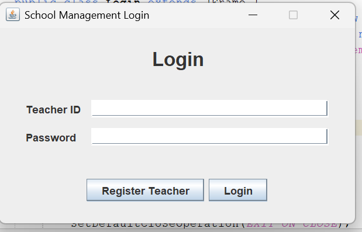
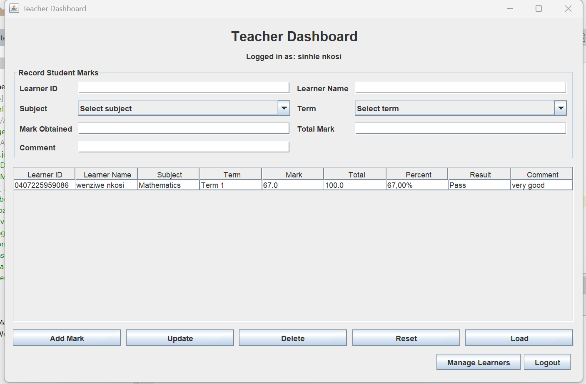
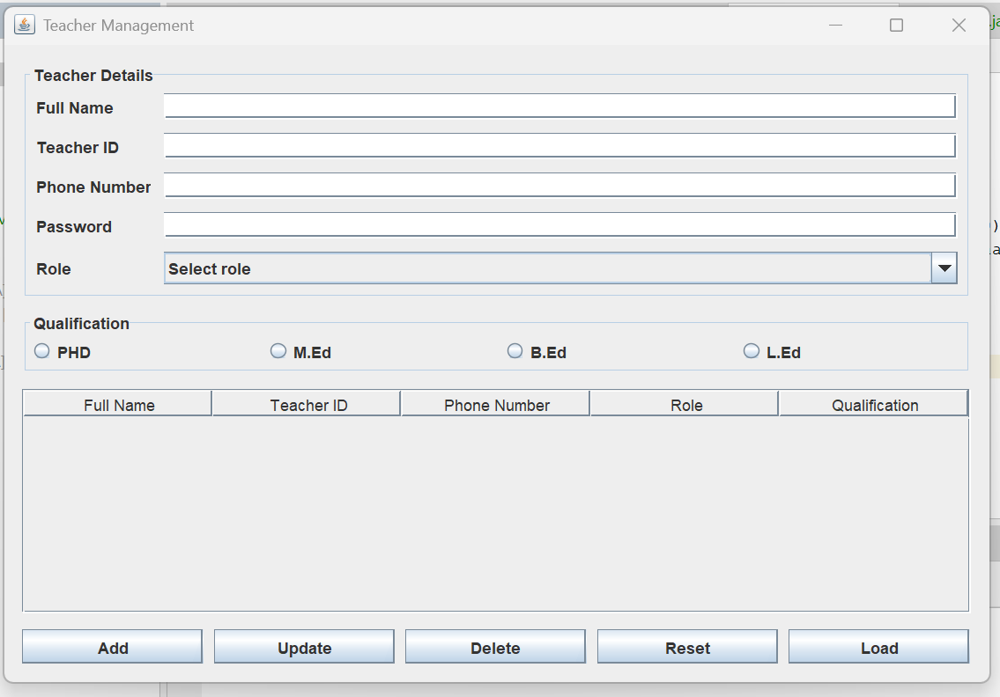
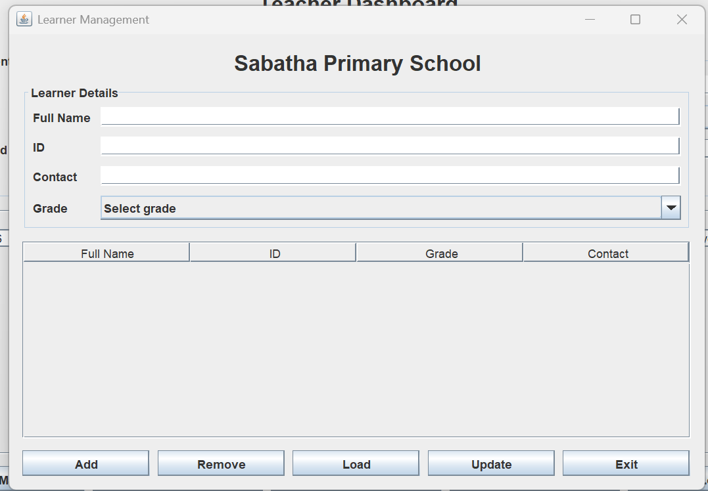

# School Management System

A Java Swing desktop application designed to manage school records, including teacher information, learner information, authentication, and student marks management.

The system uses JDBC for database communication and Apache Derby as the database platform to perform CRUD operations and store application data.

---

## Features

### Login System

- User authentication
- Secure login validation
- Session management

### Teacher Management

- Register new teachers
- View teacher records
- Update teacher information
- Delete teacher records
- Assign teacher roles
- Select teacher qualifications

### Teacher Dashboard

- Central navigation interface
- Quick access to management modules
- Improved user experience

### Learner Management

- Register learners
- View learner records
- Update learner information
- Delete learner records
- Manage learner details

### Student Marks Management

- Record student marks
- View marks records
- Update marks
- Delete marks
- Store academic information using the database

### Database Management

- JDBC database connection
- Apache Derby integration
- CRUD operations
- Database-driven application structure

---

## Technologies Used

- Java
- Java Swing
- JDBC
- Apache Derby Database
- NetBeans IDE

---

## Project Structure
School-Management-System
├── src
│   └── schoolmanagement
│       └── za
│           ├── GUI Classes
│           ├── Database Classes
│           ├── Management Classes
│           └── Model Classes
│
├── screenshots
│
├── README.md
└── build.xml

---

## Screenshots

### Login Screen

### Teacher Dashboard

### Teacher Registration

### Learner Registration

---

## How To Run

1. Clone the repository:
git clone https://github.com/PrinceSinhle/SCHOOL-MANAGEMENT-APP.git

2. Open the project using NetBeans IDE.

3. Configure the Apache Derby database connection.

4. Run the application from:

App.java

---

## Future Improvements

- Attendance management
- Report generation
- Export academic reports
- Improved user roles and permissions
- Additional database support

---

## Author

PrinceSinhle

GitHub:
https://github.com/PrinceSinhle
